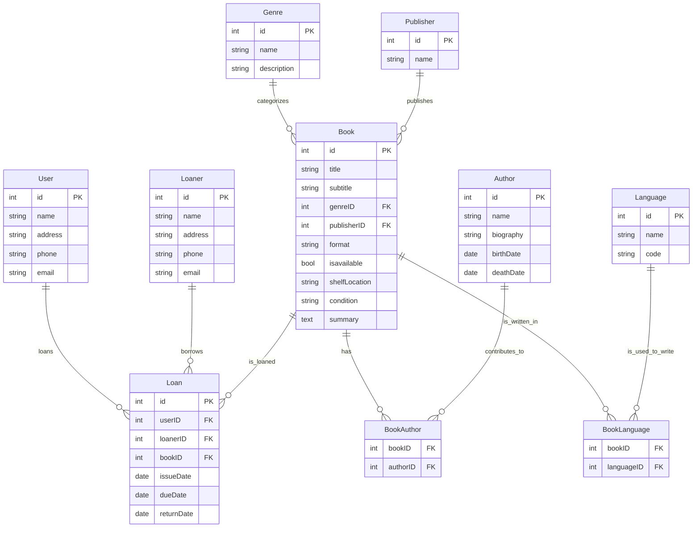

```mermaid
erDiagram
    User {
        int id PK
        string name
        string address
        string phone
        string email
    }
    Book {
        int id PK
        string title
        string subtitle
        int genreID FK
        int publisherID FK
        string format
        bool isavailable
        string shelfLocation
        string condition
        text summary
    }
    Author {
        int id PK
        string name
        string biography
        date birthDate
        date deathDate
    }
    Genre {
        int id PK
        string name
        string description
    }
    Language {
        int id PK
        string name
        string code
    }
    Publisher {
        int id PK
        string name
    }
    BookAuthor {
        int bookID FK
        int authorID FK
    }
    BookLanguage {
        int bookID FK
        int languageID FK
    }
    Loan {
        int id PK
        int userID FK
        int loanerID FK
        int bookID FK
        date issueDate
        date dueDate
        date returnDate
    }
    Loaner {
        int id PK
        string name
        string address
        string phone
        string email
    }

    User ||--o{ Loan : loans
    Loaner ||--o{ Loan : borrows
    Book ||--o{ Loan : is_loaned
    Book ||--o{ BookAuthor : has
    Author ||--o{ BookAuthor : contributes_to
    Genre ||--o{ Book : categorizes
    Book ||--o{ BookLanguage : is_written_in
    Language ||--o{ BookLanguage : is_used_to_write
    Publisher ||--o{ Book : publishes
```